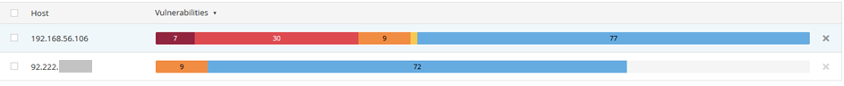
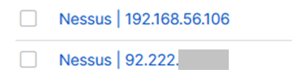
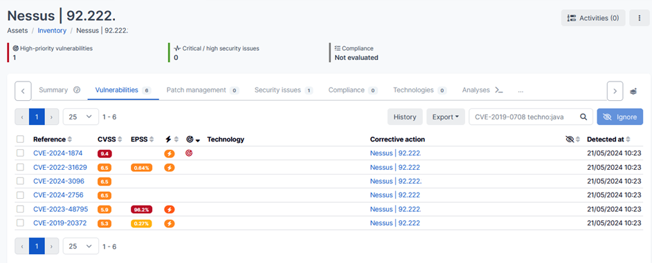

## Cyberwatch & Nessus Integration

This script will retrieve vulnerabilities of assets on Nessus and import them into Cyberwatch automatically.

For this, sets of credentials for the Nessus and Cyberwatch APIs will be required to allow the retrieval of data from Nessus, and the creation of assets on Cyberwatch.

Given the technical constraints, only the list of vulnerabilities for each asset on Nessus can be exported to Cyberwatch, without any association related to the affected technologies and recommended corrective actions.

### Use case

Let's consider the following Nessus assets.

After executing the script, these assets will be available on Cyberwatch, along with their associated list of vulnerabilities.

The vulnerabilities come from the Reference Information panel of the Nessus plugins results. However, not all plugins associate vulnerabilities with their results.

The name of the assets created on Cyberwatch can be customized, particularly to customize the string "Nessus |" in front of it.

_Caution : When using the script, all assets starting with the identifier ('Nessus |' by default) will be deleted, make sure no conflict can happen with any other unwanted asset._

### How to use

1. Generate a set of [Nessus](https://docs.tenable.com/vulnerability-management/Content/Settings/my-account/GenerateAPIKey.htm#To-generate-API-keys-for-your-own-account:) and [Cyberwatch](https://docs.cyberwatch.fr/help/en/API_documentation/API_use/#authenticate-to-the-api-and-test-your-connection) Api keys ;
2. Fill out the `api.conf` file accordingly ;
3. Launch the script without any needed arguments.
